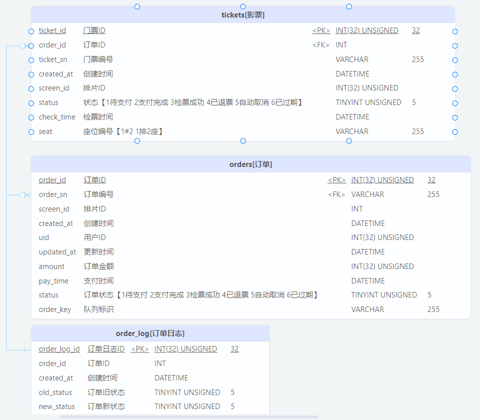
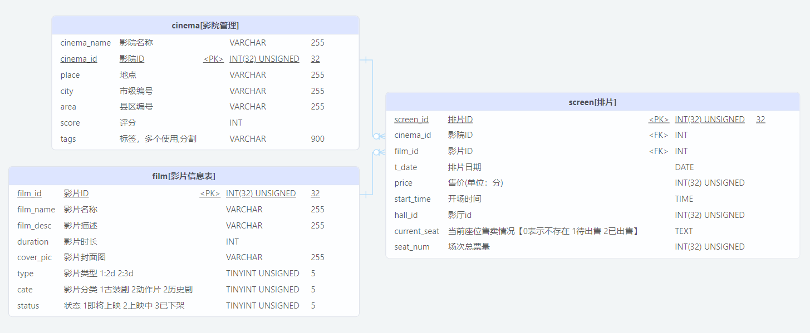

# cinema-shop

基于 go-zero 开发的影票售卖系统

### 开发工具的使用

使用make工具解决每次生成代码运行实例时需要输入很多参数的问题

开发环境 Win10，安装make工具使用 Chocolatey包管理工具安装

以写Order服务为例

```
生成api文件
make order-new-api

生成api代码
make order-gen-api

运行代码
make order-run-api

生成model文件[example:生成order服务中的order表model]
make order-gen-model-order
```

### 功能模块：

- :white_check_mark: 用户中心

- :white_check_mark: 影片相关服务

- :white_check_mark: 订单服务

- :black_square_button: 支付中心

### 可能用到的

 `mysql`  `redis`  `etcd` `rebbitmq`


### 数据表设计




